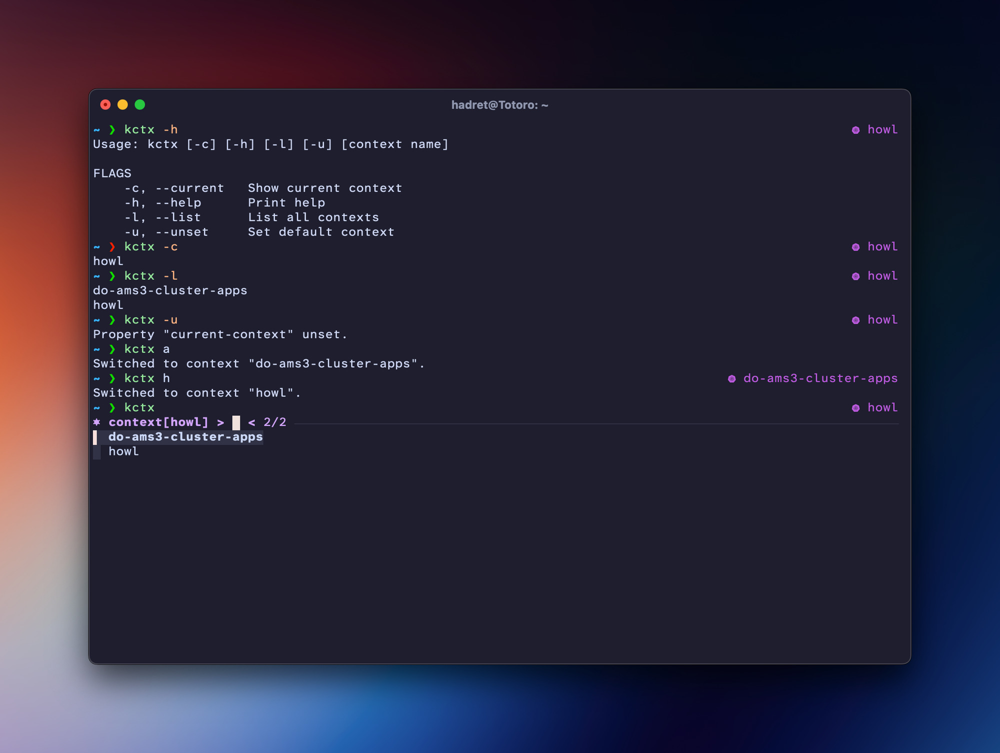
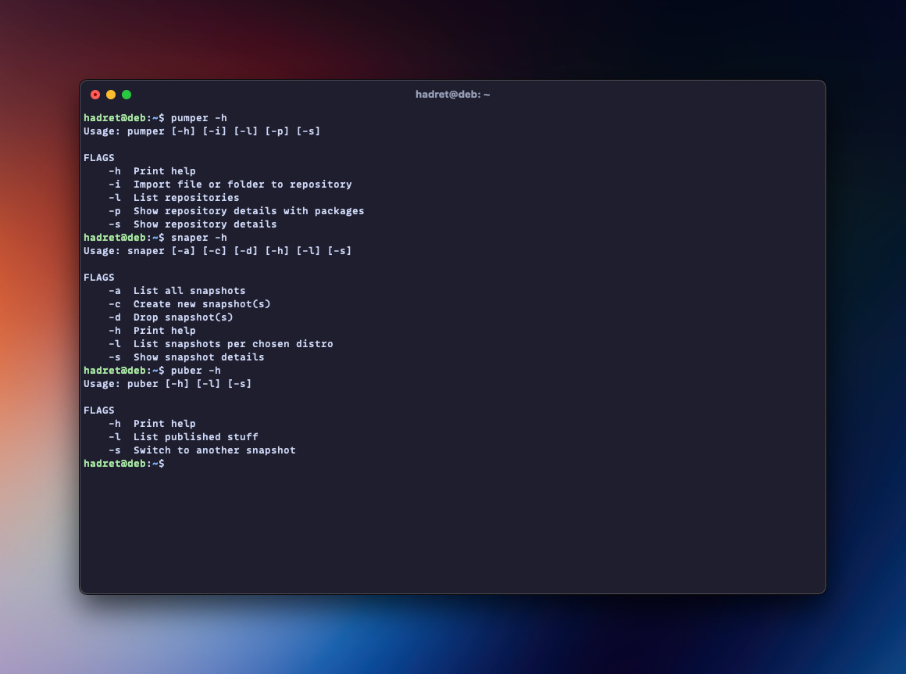

# Ba Dum Tss!

I started series called
[Terrible Shell Scripting](https://chabik.com/terrible-shell-scripting-interactive-shell/)
on my blog. As I progress with different shell scripts, going deeper in how
terrible they are, I needed a place where I can share these snippets. That will
do, I guess 🤷🏻‍♂️

Changelog

### 0.3.1 <small>November 23, 2025</small>

- Added images showcasing the scripts
- Added changelog for tracking

### 0.3.0 <small>November 5, 2025</small>

- Added Kubernetes script `koc`

### 0.2.1 <small>August 25, 2025</small>

- Switched snapshots sorting order in `puber`

### 0.2.0 <small>July 12, 2025</small>

- Added Aptly scripts `pumper`, `snaper` & `puber`

### 0.1.0 <small>June 29, 2025</small>

- Initial release

## Contexts

You can find accompanying blog post here:
[Terrible Shell Scripting: Contexts](https://chabik.com/terrible-shell-scripting-contexts/)

Scripts included:

- [dctx](contexts/dctx)
- [kctx](contexts/kctx)

## Aptly helper scripts

You can find accompanying blog post here:
[Aptly for own Debian repository](https://chabik.com/aptly-for-own-debian-repository/)

Scripts included:

- [pumper](aptly/pumper)
- [snaper](aptly/snaper)
- [puber](aptly/puber)

## Kubernetes

You can find accompanying blog post here:
[Terrible Shell Scripting: Kuberntes](https://chabik.com/terrible-shell-scripting-kubernetes)

Scripts included:

- [koc](kubernetes/koc)

## Feedback

In case you'd like to share any feedback with me, feel free to reach out on
[Mastodon](https://fosstodon.org/@hadret)!
